# FACE-RECOGNITION-ATTENDANCE-SYSTEM-USING-RASPBERRY-PI
## Data Model

## mermaid

```mermaid
%%{init: {'theme':'forest'}}%%
sequenceDiagram
    actor Consumer
    participant PatientClient as Patient Client
    participant PatientService as Patient Service

    Consumer ->>+ PatientClient : getPatients(PatientQualifier)
    PatientClient ->>+ PatientService : getPatients(GetPatientsTransaction.Request)
    rect rgb(211,255,255)
        alt PatientQualifer is NULL
            rect rgb(255,69,0)
                PatientService --x Consumer : Qualifier cannot be null
            end    
        else PatientQualifier is not NULL
            rect rgb(111,222,211)
                PatientService ->>+ PatientService  : getRetrievableAttributes(GetPatientsTransaction.Request)
                note left of PatientService : Building the secondary attributes to retrieve
                alt request has attributes
                    rect rgb(250,250,210)
                        PatientService ->>+ PatientService : keysFromAttributes(attributes)
                        deactivate PatientService
                        note left of PatientService: This helps retrieve allergies,patient contact,family contact \n and registered facility information
                    end
                end
                deactivate PatientService
                alt patient IDs is not empty
                    rect rgb(230,230,250)
                        PatientService ->>+ PatientService  : getPatientsByInternalIdentifiers(patientBaseSearchByQualifier, proxySupportFalse)
                        note left of PatientService : Patient IDs are passed for search. Proxy is not supported.Client calls are only eligible.
                        PatientService ->>+ PatientService  : getDAOByLogicalDomainId(OrganizationId(), proxySupportFalse)
                        note left of PatientService: Proxy is not supported.Client calls are only supported.
                        deactivate PatientService
                        PatientService ->>+ PatientService : toArrayAttributes(attributes)
                        deactivate PatientService
                        PatientService ->>+ PatientDataAccess : getPatientsByInternalIdentifiers(internalIds,organizationId,PatientRetrievableAttribute)
                        PatientDataAccess ->>+ PatientDataAccess : retrieveEncounter(additionalAttributes)
                        deactivate PatientDataAccess
                        PatientDataAccess ->>+ PatientDataAccess : retrieveEncounterWithType(additionalAttributes)
                        deactivate PatientDataAccess
                        PatientDataAccess ->>+ PatientDataAccess : retrieveBirthDateTmPrecision(additionalAttributes)
                        deactivate PatientDataAccess
                        PatientDataAccess ->>+ PatientSearchByInternalIdsTransaction :  searchByInternalIdsQualifier\n(PatientBaseSearchBy,retrieveEncounter,encounterType,retrieveBirthDateTmPrecision)
                        PatientSearchByInternalIdsTransaction -->>- PatientDataAccess : SearchByInternalIdsQualifier
                        PatientDataAccess ->>+ PatientAllergyDecorator : addAllergy("getPatientsByInternalIdentifiers API", patients, additionalAttributes)
                        PatientAllergyDecorator -->>- PatientDataAccess : Retrieved patient allergies
                        PatientDataAccess ->>+ PatientFamilyContactDecorator : retrieveFamilyContacts(patients, ids, additionalAttributes)
                        PatientFamilyContactDecorator -->>- PatientDataAccess : Retrieved patient family contacts
                        PatientDataAccess ->>+ FamilyContactMapper : addFamilyContactInformation(patients, ids, patientFamilyContactMap)
                        Note right of FamilyContactMapper : Maps the family contact information to the patient
                        FamilyContactMapper ->>- PatientDataAccess : Patient with family contact information
                        PatientDataAccess ->>+ PersonOrganizationRelationDecorator : retrievePersonOrganizationRelation(patients,ids,additionalAttributes)
                        PersonOrganizationRelationDecorator -->>- PatientDataAccess :  Retrieved person organization relation
                        PatientDataAccess ->>+ OrganizationRelationMapper : addOrgReltnInformation(millDomain,patients,patientIds,orgMap)
                        Note right of OrganizationRelationMapper : Maps the organization relation information to the patient
                        OrganizationRelationMapper -->>- PatientDataAccess : Patient with organization relation information
                        PatientDataAccess -->>- PatientService : patients
                        deactivate PatientService
                    end    
                else identifiers are not empty
                    rect rgb(152,251,152)
                        PatientService ->>+ PatientService : hasValidIdentifiers(Identifiers)
                        note left of PatientService : Identifiers are passed for search
                        deactivate PatientService
                        PatientService ->>+ PatientService : getPatientsBySearchCriteria(PatientSearchByCriteria, proxySupportFalse)
                        note left of PatientService : Proxy is not supported.Client calls are only supported.
                        PatientService ->>+ PatientService : getDAOByLogicalDomainId(OrganizationId(), proxySupportFalse)
                        note left of PatientService : Proxy is not supported.Client calls are only supported.
                        deactivate PatientService
                        PatientService ->>+ PatientService : toArrayAttributes(attributes)
                        deactivate PatientService
                        PatientService ->>+ PatientDataAccess : getPatientsBySearchCriteria(PatientSearchByCriteria,PatientRetrievableAttribute)
                        PatientDataAccess ->>+ PatientDataAccess : retrieveEncounter(additionalAttributes)
                        deactivate PatientDataAccess
                        PatientDataAccess ->>+ PatientDataAccess : retrieveEncounterWithType(additionalAttributes)
                        deactivate PatientDataAccess
                        PatientDataAccess ->>+ PatientDataAccess : retrieveBirthDateTmPrecision(additionalAttributes)
                        deactivate PatientDataAccess
                        PatientDataAccess ->>+ PatientAllergyDecorator : addAllergy("getPatientsBySearchCriteria API", patients, additionalAttributes)
                        PatientAllergyDecorator -->>- PatientDataAccess : Retrieved patient allergies
                        PatientDataAccess ->>+ PatientFamilyContactDecorator : retrieveFamilyContacts(patients, ids, additionalAttributes)
                        PatientFamilyContactDecorator -->>- PatientDataAccess : Retrieved patient family contacts
                        PatientDataAccess ->>+ PatientDataAccess : patientCollectionToMap(patient collection)
                        Note right of PatientDataAccess : Transform patient collection to map of patients
                        deactivate PatientDataAccess
                        PatientDataAccess ->>+ FamilyContactMapper : addFamilyContactInformation(patients, ids, patientFamilyContactMap)
                        Note right of FamilyContactMapper : Maps the family contact information to the patient
                        FamilyContactMapper -->>- PatientDataAccess : Patient with family contact information
                        PatientDataAccess ->>+ PersonOrganizationRelationDecorator : retrievePersonOrganizationRelation(patients,ids,additionalAttributes)
                        PersonOrganizationRelationDecorator -->>- PatientDataAccess :  Retrieved person organization relation
                        PatientDataAccess ->>+ OrganizationRelationMapper : addOrgReltnInformation(millDomain,patients,patientIds,orgMap)
                        Note right of OrganizationRelationMapper : Maps the organization relation information to the patient
                        OrganizationRelationMapper -->>- PatientDataAccess : Patient with organization relation information
                        PatientDataAccess -->>- PatientService : patients
                        deactivate PatientService    
                    end    
                else Patient first name and/or last name is not empty
                    rect rgb(255,218,185)
                        PatientService ->>+ PatientService : hasValidPatientFirstName(patientQualifier)
                        deactivate PatientService
                        PatientService ->>+ PatientService : hasValidPatientLastName(patientQualifier)
                        deactivate PatientService
                        alt valid qualifier option on request
                            rect rgb(221,160,221)
                                PatientService ->>+ PatientService : hasValidPatientFirstName(patientQualifier)
                                note left of PatientService : if patient has valid first name
                                PatientService ->>+ PatientService : hasValidPatientLastName(patientQualifier)
                                note left of PatientService : if patient has valid last name
                                deactivate PatientService
                                deactivate PatientService
                                PatientService ->>+ PatientService : getPatientsBySearchCriteria(PatientSearchByCriteria, proxySupportFalse)
                                note left of PatientService : Proxy is not supported.Client calls are only supported.
                                PatientService ->>+ PatientService : getDAOByLogicalDomainId(OrganizationId(), proxySupportFalse)
                                note left of PatientService : Proxy is not supported.Client calls are only supported.
                                deactivate PatientService
                                PatientService ->>+ PatientService : toArrayAttributes(attributes)
                                deactivate PatientService
                                PatientService ->>+ PatientDataAccess : getPatientsBySearchCriteria(PatientSearchByCriteria,PatientRetrievableAttribute)
                                PatientDataAccess ->>+ PatientDataAccess : retrieveEncounter(additionalAttributes)
                                deactivate PatientDataAccess
                                PatientDataAccess ->>+ PatientDataAccess : retrieveEncounterWithType(additionalAttributes)
                                deactivate PatientDataAccess
                                PatientDataAccess ->>+ PatientDataAccess : retrieveBirthDateTmPrecision(additionalAttributes)
                                deactivate PatientDataAccess
                                PatientDataAccess ->>+ PatientSearchByCriteriaTransaction : searchByCriteriaQualifier(PatientSearchByCriteria,retrieveEncounter,encounterType,retrieveBirthDateTmPrecision))
                                PatientSearchByCriteriaTransaction -->>- PatientDataAccess : SearchByCriteriaQualifier
                                PatientDataAccess ->>+ PatientAllergyDecorator: addAllergy("getPatientsBySearchCriteria API", patients, additionalAttributes)
                                PatientAllergyDecorator -->>- PatientDataAccess : Retrieved patient allergies
                                PatientDataAccess ->>+ PatientFamilyContactDecorator : retrieveFamilyContacts(patients, ids, additionalAttributes)
                                PatientFamilyContactDecorator -->>- PatientDataAccess : Retrieved patient family contacts
                                PatientDataAccess ->>+ PatientDataAccess : patientCollectionToMap(patient collection)
                                Note right of PatientDataAccess : Transform patient collection to map of patients
                                deactivate PatientDataAccess
                                PatientDataAccess ->>+ FamilyContactMapper : addFamilyContactInformation(patients, ids, patientFamilyContactMap)
                                Note right of FamilyContactMapper : Maps the family contact information to the patient
                                FamilyContactMapper -->>- PatientDataAccess : Patient with family contact information
                                PatientDataAccess ->>+ PersonOrganizationRelationDecorator : retrievePersonOrganizationRelation(patients,ids,additionalAttributes)
                                PersonOrganizationRelationDecorator -->>- PatientDataAccess :  Retrieved person organization relation
                                PatientDataAccess ->>+ OrganizationRelationMapper : addOrgReltnInformation(millDomain,patients,patientIds,orgMap)
                                Note right of OrganizationRelationMapper : Maps the organization relation information to the patient
                                OrganizationRelationMapper -->>- PatientDataAccess : Patient with organization relation information
                                PatientDataAccess -->>- PatientService : patients
                            end
                        else invalid qualifier
                            rect rgb(255,69,0)
                                PatientService --x- Consumer : Invalid qualifier option\n on request
                            end    
                        end
                        deactivate PatientService
                    end    
                end    
            end
        PatientService ->>+ PatientService : Converting all the legacy patients to iBus patients
        deactivate PatientService
        PatientService ->>+ PatientService : Filter out the unwanted non-qualifying patients based on patient IDs
        deactivate PatientService
        PatientService ->>+ PatientService : decoratePatients(legacyPatientList,request,allergyList,\n patientContactInfoList,patientContactDetailsList,\n familyContactInfoList,registeredFacilityInfoList,patientConverter)
        note right of PatientService : Decorate the patients with additional attributes if applicable
        
        PatientService -->>- PatientClient :  GetPatientsTransaction.Reply
        PatientClient -->>- Consumer : GetPatientsTransaction.Reply
        Consumer ->>+ GetPatientsTransaction : GetPatientsTransaction.Reply.getPatients()
        note right of GetPatientsTransaction : Returns the patients from the last reply. This method will never return null, however the return value is unmodifiable.
        GetPatientsTransaction -->>- Consumer : List<Patient>
        Consumer ->>+ GetPatientsTransaction : GetPatientsTransaction.Reply.getAllergies()
        note right of GetPatientsTransaction : Returns the allergies from the last reply. This method will never return null, however the return value is unmodifiable.
        GetPatientsTransaction -->>- Consumer : List<Allergy>
        Consumer ->>+ GetPatientsTransaction : GetPatientsTransaction.Reply.getPatientContactInfo()
        note right of GetPatientsTransaction : Returns the patient contact info from the last reply. This method will never return null, however the return value is unmodifiable.
        GetPatientsTransaction -->>- Consumer : List<PatientContactInfo>
        Consumer ->>+ GetPatientsTransaction : GetPatientsTransaction.Reply.getFamilyContactInfo()
        note right of GetPatientsTransaction : Returns the family contact info from the last reply. This method will never return null, however the return value is unmodifiable.
        GetPatientsTransaction -->- Consumer : List<FamilyContactInfo>
        Consumer ->>+ GetPatientsTransaction : GetPatientsTransaction.Reply.getRegisteredFacilityInfo()
        note right of GetPatientsTransaction : Returns the registered facility info from the last reply. This method will never return null, however the return value is unmodifiable.
        GetPatientsTransaction -->- Consumer  : List<RegisteredFacilityInfo>
    
        end
    end
```

[![](https://mermaid.ink/img/pako:eNrNWttu2zgQ_RVDT3GbPPQ1KAr4ojRGbDmwlRbtemEwEm1zVxa9ugR1i_rbd0hJFimSkq1kNwmCIuIMh4eHM8Mh2V-WR31sXVtegOJ4SNA6QttF2IEf3tLpBQGO1vtfWRv7uSJ-57ozTyISroXWHUoIDpORVuiTeBegvU4UYeQlhIYxCMckTg6ZxkFQifETjkii7Z7ju-inJPBx1C1F79cY0Fx0lT5McF-gNciHGWCDdFZgBrkeM9Oa57B1Rjy6Y-05akGQ0ExX12mD4s0AlgtkJEwEAf4nRUF8MX38C3tJt_NIaYBRKChs0a6_h8kOKNDFoR9y4g7dzgTt8glcFsstzSSi6Ym9OReF6FBdilhvwERgNmy5UM8a_WimFYhyvZ8FosGMiuG3FIkJiB7TBMdCML7v23N3aTsDx50tR8Plnf0NosTd77B_h_eaGfVHM_d2Oey59tIdTezl1xF83s_swWg-mjrN_e977sh23OV8foJyrz-fjh9gqOqojT0f7ofuEiZV1RxTjR78upOq5gAFOPRRJCaSksKLrsSwyHOfRMlmiBLski0W894eowhGGIUJXosxe7WlYbJhyWlDo0TMelnGq7RuaMrM9PcJFm2QEHCp7TH2aOir7SEKqRbMTxpifRKWJqZJmFfeBnt_f0EB8eGfFF8MNhEN6Q3BgX_pdDsHp4N_JEBq3HHS7SOOKu79DfiB1KRAYrIJo4jlNJkMnmqzNKsKboEoliOliXNjnCutaM7p0oocYMwE7zsnTZdzEzqmHgoYbSzZF3-rGpzUXIP9rbchahXfkiZrmJAgIHxvoa-yafCgEEPiBm1JsB_AGkICG4Ur2nlmPbAiUQwLssU6IQxplEU4QDyFbsgudmme1s2lw24DK3ssLe7ZlyhWJvbSdcRNMVGDfIxqxTPtdGurDj7HY2FSnfEbKDwUzis7qCpvKkaaLHImVKX6AkVntEWp8jLY9OXLSRAhmMVQzi01x29tiG6J7we4TQCH0D5PVyvyQyclPmAjK4KjMmaLqRcSMX4fxS2NbZLit6C3hl0Ls133M_9DkKBjSQBSRiVscbA-gkYRdGdmhqbInxwpbJcanCORBoWSsSIbfFS4_CR3kSuErolOppoRCTpVRplQrLO0pL6BNJRzUQnHorUp5eh7iw7bkF5KA_VJpXSjZ41-NNMKhOCr56EwuXwrFMeAeBYThZVWEISgexaI0s6ZOHJHLiPbCEOJ9Xrnbmex3uEbbDam9wKdnJaM-CS1emySah08SfGQF8fifpqlP2E7_fgRh-kWR7xu-yQk2Afnzpl-dcqGSW9sl183tvw9dW_tmWbAHOBgg8I1tp8qe7mXRlFWEOd6Yi0c4SdC01gr9Lg9dnpm--DxQ90HhYENW-IgwwBZWhmG1zI5DJO8HJxtHhok70nc833MNl4105N4hrf0ySD9H09Q8qqV8zjFVXrDoeA39-zepPye2ZPpF-G7uJHpjcf27PO35eC253zWyPNLIn3nwXTSHzkawYNjFN2OhtoOcrvg9gZPzurXIU4QCcS7rfoj5E7qzQ-lcsWoP0E0nQi1oAyO3nT4U4FcdE-A-PZOcXUHHC1hNVthRfGkg45pjOomWetgjOWTvStOIgy1AhFcRb1c8AxvEnECG4am_SfZ6dQ9moZJpLUkO2uOoPOHjyGXezCI_6eU3wnNn0nki6OrJEvrinm8BSJ1Ao3ntguBeclj7a3FTRoEcyiKmGbWB1J8hOPYdLoC_UkaJGQX8D7xKZ0GhscYjjO74NPJvpOdyWC2cqbwl2JYf1mTL5l61wfCfAvUmbbZwr2Bd6XTE4Pp6kOj1SIlnHQ_w_n8DwAyu-dj0-eqsg4WUxUokHXILzCUUDXF9hO7wtcJqP6-RwFgiPhejsXgmTVOmz0q6GVTAhnk-vX8uboaLHTFFQj5g8eZT9tbMA4t2sR-dq7mkAxrkj3HtHrKnmQYTSmsTX56nRykRDevmXQBzQWNMZx3bwjbGV6DAo6wf4M8EgBV1TKDRmtg-Cev8Ufnv5Qwd5iY_QhOn_ZqxTA_YeEetOJTepQGZ5pKgFu-e7glbNMWpkH-ek9esi9VKBDcQs-kzs0Mmoc6suOThmrxCvHSsPV78smIeRAVb3fvrq4-5dco4Ll2eSI-qghXDpn2QLyskHqoL5UL693CyrotrA_wJ49s6LcAEMVvJyu0S1Bqr-r2WLUgPF2IZj7IZvqVB4tH-YZdM2HFRPnmmV_2lN2k85FxDvKRWT1Hm-0JSN4JTBbkWZcWrASUpr51bfEcuLCSDYaJWUCW5eMVgpJ9YS3C36CKUojhfehZ1ysISnxppTsfiMj_D1re-vtfYJFbLg?type=png)](https://mermaid.live/edit#pako:eNrNWttu2zgQ_RVDT3GbPPQ1KAr4ojRGbDmwlRbtemEwEm1zVxa9ugR1i_rbd0hJFimSkq1kNwmCIuIMh4eHM8Mh2V-WR31sXVtegOJ4SNA6QttF2IEf3tLpBQGO1vtfWRv7uSJ-57ozTyISroXWHUoIDpORVuiTeBegvU4UYeQlhIYxCMckTg6ZxkFQifETjkii7Z7ju-inJPBx1C1F79cY0Fx0lT5McF-gNciHGWCDdFZgBrkeM9Oa57B1Rjy6Y-05akGQ0ExX12mD4s0AlgtkJEwEAf4nRUF8MX38C3tJt_NIaYBRKChs0a6_h8kOKNDFoR9y4g7dzgTt8glcFsstzSSi6Ym9OReF6FBdilhvwERgNmy5UM8a_WimFYhyvZ8FosGMiuG3FIkJiB7TBMdCML7v23N3aTsDx50tR8Plnf0NosTd77B_h_eaGfVHM_d2Oey59tIdTezl1xF83s_swWg-mjrN_e977sh23OV8foJyrz-fjh9gqOqojT0f7ofuEiZV1RxTjR78upOq5gAFOPRRJCaSksKLrsSwyHOfRMlmiBLski0W894eowhGGIUJXosxe7WlYbJhyWlDo0TMelnGq7RuaMrM9PcJFm2QEHCp7TH2aOir7SEKqRbMTxpifRKWJqZJmFfeBnt_f0EB8eGfFF8MNhEN6Q3BgX_pdDsHp4N_JEBq3HHS7SOOKu79DfiB1KRAYrIJo4jlNJkMnmqzNKsKboEoliOliXNjnCutaM7p0oocYMwE7zsnTZdzEzqmHgoYbSzZF3-rGpzUXIP9rbchahXfkiZrmJAgIHxvoa-yafCgEEPiBm1JsB_AGkICG4Ur2nlmPbAiUQwLssU6IQxplEU4QDyFbsgudmme1s2lw24DK3ssLe7ZlyhWJvbSdcRNMVGDfIxqxTPtdGurDj7HY2FSnfEbKDwUzis7qCpvKkaaLHImVKX6AkVntEWp8jLY9OXLSRAhmMVQzi01x29tiG6J7we4TQCH0D5PVyvyQyclPmAjK4KjMmaLqRcSMX4fxS2NbZLit6C3hl0Ls133M_9DkKBjSQBSRiVscbA-gkYRdGdmhqbInxwpbJcanCORBoWSsSIbfFS4_CR3kSuErolOppoRCTpVRplQrLO0pL6BNJRzUQnHorUp5eh7iw7bkF5KA_VJpXSjZ41-NNMKhOCr56EwuXwrFMeAeBYThZVWEISgexaI0s6ZOHJHLiPbCEOJ9Xrnbmex3uEbbDam9wKdnJaM-CS1emySah08SfGQF8fifpqlP2E7_fgRh-kWR7xu-yQk2Afnzpl-dcqGSW9sl183tvw9dW_tmWbAHOBgg8I1tp8qe7mXRlFWEOd6Yi0c4SdC01gr9Lg9dnpm--DxQ90HhYENW-IgwwBZWhmG1zI5DJO8HJxtHhok70nc833MNl4105N4hrf0ySD9H09Q8qqV8zjFVXrDoeA39-zepPye2ZPpF-G7uJHpjcf27PO35eC253zWyPNLIn3nwXTSHzkawYNjFN2OhtoOcrvg9gZPzurXIU4QCcS7rfoj5E7qzQ-lcsWoP0E0nQi1oAyO3nT4U4FcdE-A-PZOcXUHHC1hNVthRfGkg45pjOomWetgjOWTvStOIgy1AhFcRb1c8AxvEnECG4am_SfZ6dQ9moZJpLUkO2uOoPOHjyGXezCI_6eU3wnNn0nki6OrJEvrinm8BSJ1Ao3ntguBeclj7a3FTRoEcyiKmGbWB1J8hOPYdLoC_UkaJGQX8D7xKZ0GhscYjjO74NPJvpOdyWC2cqbwl2JYf1mTL5l61wfCfAvUmbbZwr2Bd6XTE4Pp6kOj1SIlnHQ_w_n8DwAyu-dj0-eqsg4WUxUokHXILzCUUDXF9hO7wtcJqP6-RwFgiPhejsXgmTVOmz0q6GVTAhnk-vX8uboaLHTFFQj5g8eZT9tbMA4t2sR-dq7mkAxrkj3HtHrKnmQYTSmsTX56nRykRDevmXQBzQWNMZx3bwjbGV6DAo6wf4M8EgBV1TKDRmtg-Cev8Ufnv5Qwd5iY_QhOn_ZqxTA_YeEetOJTepQGZ5pKgFu-e7glbNMWpkH-ek9esi9VKBDcQs-kzs0Mmoc6suOThmrxCvHSsPV78smIeRAVb3fvrq4-5dco4Ll2eSI-qghXDpn2QLyskHqoL5UL693CyrotrA_wJ49s6LcAEMVvJyu0S1Bqr-r2WLUgPF2IZj7IZvqVB4tH-YZdM2HFRPnmmV_2lN2k85FxDvKRWT1Hm-0JSN4JTBbkWZcWrASUpr51bfEcuLCSDYaJWUCW5eMVgpJ9YS3C36CKUojhfehZ1ysISnxppTsfiMj_D1re-vtfYJFbLg)

