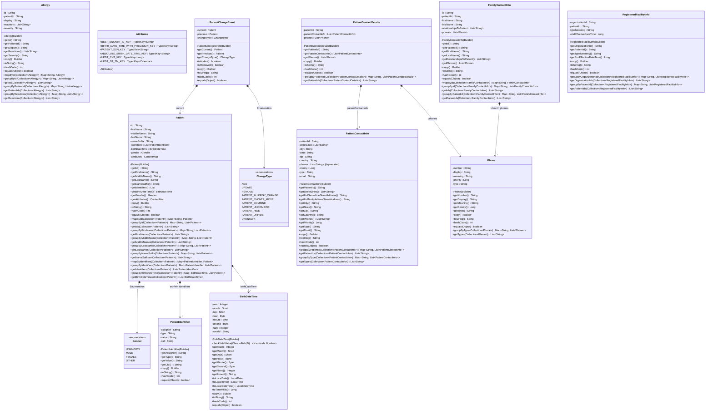

# FACE-RECOGNITION-ATTENDANCE-SYSTEM-USING-RASPBERRY-PI

```mermaid
classDiagram
class Allergy{
        -id : String
        -patientId : String
        -display : String
        -reactions : List~String~
        -severity : String
        -Allergy(Builder)
        +getId() String
        +getPatientId() String
        +getDisplay() String
        +getReactions() List~String~
        +getSeverity() String
        +copy() Builder
        +toString() String
        +hashCode() int
        +equals(Object) boolean
        +mapById(Collection~Allergy~) Map~String, Allergy~
        +groupById(Collection~Allergy~) Map~String, List~Allergy~~
        +getIds(Collection~Allergy~) List~String~
        +groupByPatientId(Collection~Allergy~) Map~String, List~Allergy~~
        +getPatientIds(Collection~Allergy~) List~String~
        +groupByReactions(Collection~Allergy~) Map~String, List~Allergy~~
        +getReactions(Collection~Allergy~) List~String~
    }
class Attributes{
        +BEST_ENCNTR_ID_KEY : TypedKey~String~
        +BIRTH_DATE_TIME_WITH_PRECISION_KEY : TypedKey~String~
        +PATIENT_SSN_KEY : TypedKey~String~
        +ABSOLUTE_BIRTH_DATE_TIME_KEY : TypedKey~String~
        +UPDT_CNT_KEY : TypedKey~Long~
        +UPDT_DT_TM_KEY : TypedKey~Calendar~
        -Attributes()
    }
    
    class BirthDateTime{
        -year : Integer
        -month : Short
        -day : Short
        -hour : Byte
        -minute : Byte
        -second : Byte
        -nano : Integer
        -zoneId : String
        -BirthDateTime(Builder)
        -checkValidValue(ChronoField,N) ~N extends Number~
        +getYear() Integer
        +getMonth() Short
        +getDay() Short
        +getHour() Byte
        +getMinute() Byte
        +getSecond() Byte
        +getNano() Integer
        +getZoneId() String
        +toLocalDate() LocalDate
        +toLocalTime() LocalTime
        +toLocalDateTime() LocalDateTime
        +toTimeMillis() Long
        +copy() Builder
        +toString() String
        +hashCode() int
        +equals(Object) boolean
  }
  
    class FamilyContactInfo {
        -id : String
        -patientId : String
        -firstName : String
        -lastName : String
        -relationshipsToPatient : List~String~
        -phones : List~Phone~
        -FamilyContactInfo(Builder)
        +getId() String
        +getPatientId() String
        +getFirstName() String
        +getLastName() String
        +getRelationshipsToPatient() List~String~
        +getPhones() List~Phone~
        +copy() Builder
        +toString() String
        +hashCode() int
        +equals(Object) boolean
        +mapById(Collection~FamilyContactInfo~) Map~String, FamilyContactInfo~
        +groupById(Collection~FamilyContactInfo~) Map~String, List~FamilyContactInfo~~
        +getIds(Collection~FamilyContactInfo~) List~String~
        +groupByPatientId(Collection~FamilyContactInfo~) Map~String, List~FamilyContactInfo~~
        +getPatientIds(Collection~FamilyContactInfo~) List~String~
   }

    class Patient{
        -id : String
        -firstName : String
        -middleName : String
        -lastName : String
        -nameSuffix : String
        -identifiers : List~PatientIdentifier~
        -birthDateTime : BirthDateTime
        -gender : Gender
        -attributes : ContextMap
        -Patient(Builder)
        +getId() String
        +getFirstName() String
        +getMiddleName() String
        +getLastName() String
        +getNameSuffix() String
        +getIdentifiers() List<PatientIdentifier>
        +getBirthDateTime() BirthDateTime
        +getGender() Gender
        +getAttributes() ContextMap
        +copy() Builder
        +toString() String
        +hashCode() int
        +equals(Object) boolean
        +mapById(Collection~Patient~) Map~String, Patient~
        +groupById(Collection~Patient~) Map~String, List~Patient~~
        +getIds(Collection~Patient~) List~String~
        +groupByFirstName(Collection~Patient~) Map~String, List~Patient~~
        +getFirstNames(Collection~Patient~) List~String~
        +groupByMiddleName(Collection~Patient~) Map~String, List~Patient~
        +getMiddleNames(Collection~Patient~) List~String~
        +groupByLastName(Collection~Patient~) Map~String, List~Patient~~
        +getLastNames(Collection~Patient~) List~String~
        +groupByNameSuffix(Collection~Patient~) Map~String, List~Patient~~
        +getNameSuffixes(Collection~Patient~) List~String~
        +mapByIdentifiers(Collection~Patient~) Map~PatientIdentifier, Patient~
        +groupByIdentifiers(Collection~Patient~) Map~PatientIdentifier, List~Patient~~
        +getIdentifiers(Collection~Patient~) List~PatientIdentifier~
        +groupByBirthDateTime(Collection~Patient~) Map~BirthDateTime, List~Patient~~
        +getBirthDateTimes(Collection~Patient~) List~BirthDateTime~
  }

    class Gender{
        <<enumeration>>
        UNKNOWN
        MALE
        FEMALE
        OTHER
  }

    class PatientChangeEvent{
        -current : Patient
        -previous : Patient
        -changeType : ChangeType
        -PatientChangeEvent(Builder)
        +getCurrent() Patient
        +getPrevious() Patient
        +getChangeType() ChangeType
        +isAdded() boolean
        +isRemoved() boolean
        +copy() Builder
        +toString() String
        +hashCode() int
        +equals(Object) boolean
  }


    class ChangeType{
        <<enumeration>>
        ADD
        UPDATE
        REMOVE
        PATIENT_ALLERGY_CHANGE
        PATIENT_ENCNTR_MOVE
        PATIENT_COMBINE
        PATIENT_UNCOMBINE
        PATIENT_HIDE
        PATIENT_UNHIDE
        UNKNOWN
  }

    class PatientContactDetails{
        -patientId : String
        -patientContactInfo : List~PatientContactInfo~
        -phones : List~Phone~
        -PatientContactDetails(Builder)
        +getPatientId() String
        +getPatientContactInfo() List~PatientContactInfo~
        +getPhones() List~Phone~
        +copy() Builder
        +toString() String
        +hashCode() int
        +equals(Object) boolean
        +groupByPatientId(Collection~PatientContactDetails~) Map~String, List~PatientContactDetails~~
        +getPatientIds(Collection~PatientContactDetails~) List~String~
  }

    class PatientContactInfo{
        -patientId : String
        -streetLines : List~String~
        -city : String
        -state: String
        -zip : String
        -country : String
        -phones : List~String~ [deprecated]
        -priority : Long
        -type : String
        -email : String
        -PatientContactInfo(Builder)
        +getPatientId() String
        +getStreetLines() List~String~
        +getFullSameLineStreetAddress() String
        +getFullMultipleLinesStreetAddress() String
        +getCity() String
        +getState() String
        +getZip() String
        +getCountry() String
        +getPhones() List~String~
        +getPriority() Long
        +getType() String
        +getEmail() String
        +copy() Builder
        +toString() String
        +hashCode() int
        +equals(Object) boolean
        +groupByPatientId(Collection~PatientContactInfo~) Map~String, List~PatientContactInfo~~
        +getPatientIds(Collection~PatientContactInfo~) List~String~
        +groupByType(Collection~PatientContactInfo~) Map~String, List~PatientContactInfo~~
        +getTypes(Collection~PatientContactInfo~) List~String~
  }

    class PatientIdentifier{
        -assigner : String
        -type : String
        -value : String
        -oid : String
        -PatientIdentifier(Builder)
        +getAssigner() String
        +getType() String
        +getValue() String
        +getOid(): String
        +copy() Builder
        +toString() String
        +hashCode() int
        +equals(Object) boolean
  }

    class Phone{
        -number : String
        -display : String
        -meaning : String
        -priority : Long
        -type : String
        -Phone(Builder)
        +getNumber() String
        +getDisplay() String
        +getMeaning() String
        +getPriority() Long
        +getType() String
        +copy() Builder
        +toString() String
        +hashCode() int
        +equals(Object) boolean
        +groupByType(Collection~Phone~) Map~String, List~Phone~~
        +getTypes(Collection~Phone~) List~String~
  }

    class RegisteredFacilityInfo{
        -organizationId : String
        -patientId : String
        -typeMeaning : String
        -endEffectiveDateTime : Long
        -RegisteredFacilityInfo(Builder)
        +getOrganizationId() String
        +getPatientId() String
        +getTypeMeaning() String
        +getEndEffectiveDateTime() Long
        +copy() Builder
        +toString() String
        +hashCode() int
        +equals(Object) boolean
        +groupByOrganizationId(Collection~RegisteredFacilityInfo~) Map~String, List~RegisteredFacilityInfo~~
        +getOrganizationIds(Collection~RegisteredFacilityInfo~) List~String~
        +groupByPatientId(Collection~RegisteredFacilityInfo~) Map~String, List~RegisteredFacilityInfo~~
        +getPatientIds(Collection~RegisteredFacilityInfo~) List~String~
  }

Patient *--> Gender : Enumeration
PatientChangeEvent *--> ChangeType : Enumeration
FamilyContactInfo "*" *--> "1" Phone : \n\n\n\n phones
Patient "*" *--> "1" PatientIdentifier : \n\n\n\n identifiers
Patient "1" *--> "1" BirthDateTime : birthDateTime
PatientChangeEvent "1" *--> "1" Patient : current
PatientContactDetails "*" *--> "1" PatientContactInfo : patientContactInfo
PatientContactDetails "1" *--> "*" Phone : phones
    
```
